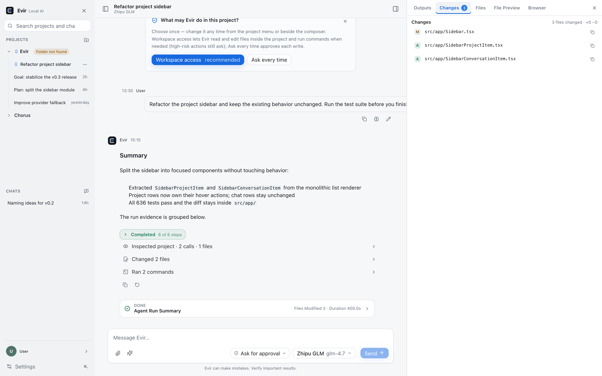
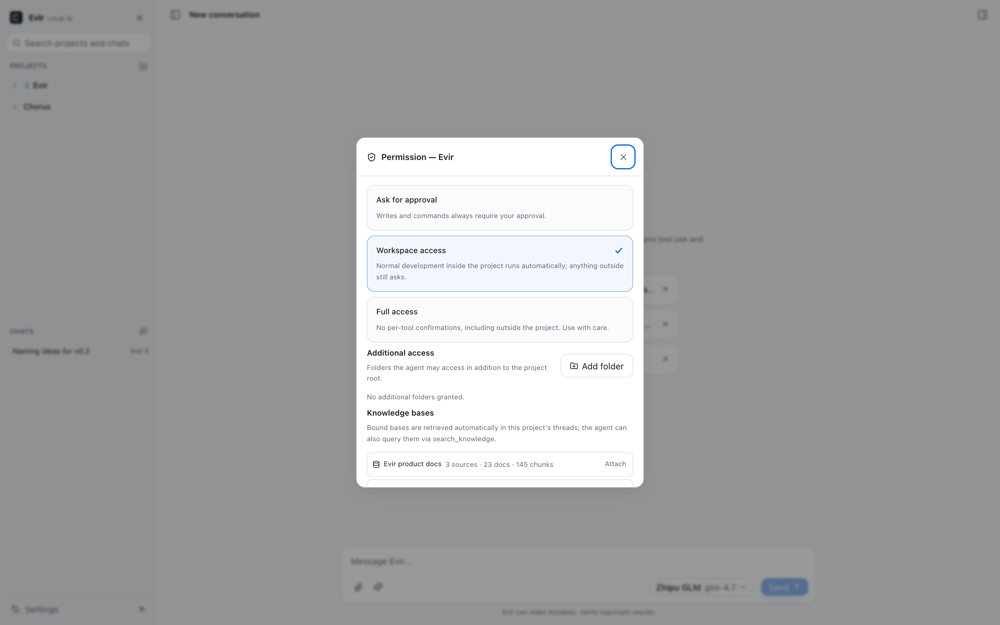
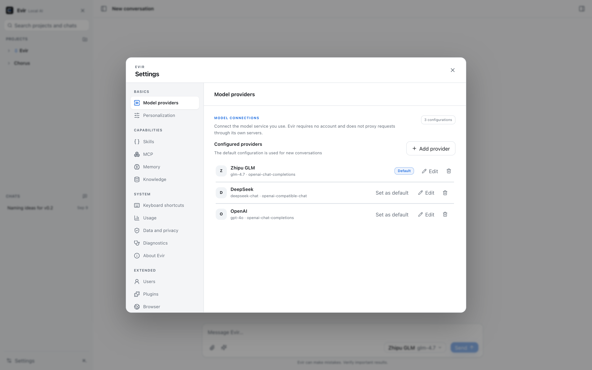
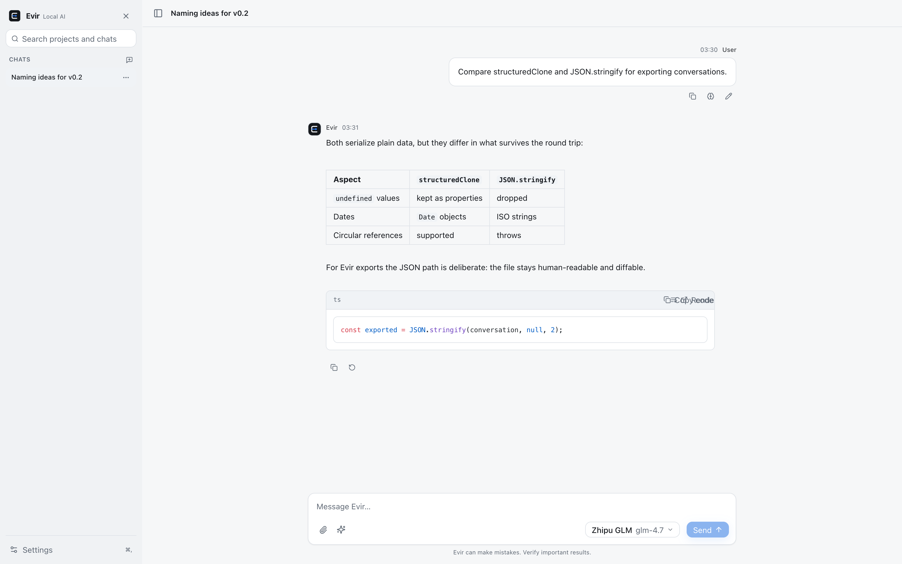

<div align="center">

# Evir

**Your model. Your computer. Your agent.**

A clean, local-first, bring-your-own-model AI client and general-purpose desktop agent.

**Connect one tool-capable model and Evir Desktop can read code, edit files, run commands, and verify itself inside your projects.**

[简体中文](README.md) · [Product Spec](docs/01-product-requirements.md) · [Development Guide](docs/03-development-guide.md) · [Roadmap](docs/06-development-plan.md)

</div>

---



## Works on real projects

The Desktop sidebar has two sections: **PROJECTS** and **CHATS**. A project maps to one local folder — create a task inside it and the Agent's working directory is the project root. No workspace picker, and if the folder moves, re-locating it keeps every thread and permission intact.

A compact control bar above the composer decides **how** the agent works:

- **Mode** — Agent / Plan / Goal as first-class modes (plain chats live in CHATS, stay Ask-only, and never touch local files).
- **Permission** — how much runs automatically, per project.
- **Model** — who does the work, switchable mid-conversation.

```text
Create a project (pick a folder) → new task → pick Mode / Permission / Model
→ agent reads · edits · executes · verifies → diff / snapshot / rollback
```

- **Agent**: executes 13 built-in tools (read/write/search/patch/command/git/snapshot) plus MCP tools under the permission policy, with pause, approval, and rollback.
- **Plan**: read-only inspection of the project that produces a structured plan, then one-click **Execute Plan** continues as Agent.
- **Goal**: long-running objectives with explicit done-when conditions; Evir verifies each condition with real evidence — the model saying "done" is not done.

### Permission decides autonomy



Every project picks one of three levels: **Ask for Approval** (default; writes need per-call approval), **Workspace Access** (routine in-project actions run automatically and land in the audit log), or **Full Access** (removes the directory boundary; first activation always requires an explicit confirmation). Projects can also grant additional access roots. Tool boundaries are enforced in the Tool Registry and the Rust layer — not by prompts.

## Bring your own model

Providers, protocols, and model capabilities are separate layers: 36 built-in presets for international and Chinese vendors, 7 implemented protocol adapters (OpenAI Chat Completions / Responses, Anthropic Messages, Gemini, Azure OpenAI, native Ollama, OpenAI-compatible), and custom compatible endpoints. API keys live in a local encrypted vault (AES-256-GCM, no OS keychain dependency) and never enter logs.



Capabilities (streaming, tool calling, vision, structured output) are shown before use; a model without tool calling can still chat, but Agent/Plan/Goal are disabled with a reason. In-conversation switching goes through safe checkpoints that handle context, attachments, and data destination; automatic cross-provider fallback stays off. See the [provider and protocol matrix](docs/13-provider-and-protocol-matrix.md).

## Four surfaces, one capability core

|                               | Evir Desktop           | Evir Web               | Evir for VS Code       | Evir CLI                |
| ----------------------------- | ---------------------- | ---------------------- | ---------------------- | ----------------------- |
| Focus                         | General desktop agent  | Clean multi-model chat | In-editor agent        | Terminal agent          |
| Chat / attachments            | ✅                     | ✅                     | ✅                     | ✅ (ask)                |
| Local tools / terminal / git  | ✅                     | —                      | ✅ (trusted workspace) | ✅ (workspace boundary) |
| Agent / Plan / Goal           | ✅                     | —                      | Agent                  | Agent                   |
| Skills                        | 36 built-in + your own | 10 instruction-only    | —                      | —                       |
| MCP (stdio + Streamable HTTP) | ✅                     | —                      | —                      | —                       |

- **Web**: a static-file chat client that talks straight from the browser to your providers, with no Evir backend; CORS-limited endpoints are detected and called out.
- **VS Code** (Preview): a standalone VSIX with keys in VS Code SecretStorage; per-call approval for writes and commands plus diff/rollback for the last write. VS Code Web / Remote / MCP / Skills are not supported yet.
- **CLI** (Preview): a standalone `evir` command (configure / doctor / ask / agent) that shares non-secret provider profiles with Desktop (secrets are stored independently) without requiring it to run.



## Local-first and diagnosable

```text
API keys            → local encrypted vault (AES-256-GCM)
Provider config     → versioned non-secret local files
Chats / runs / memory → embedded local storage (SQLite / IndexedDB)
Logs / diffs / snapshots → local artifact directory
```

- No accounts, credits, ads, or required cloud backend; data stays on your device by default.
- Logs cover providers, agents, tools, approvals, and performance — redacted by default, stored locally, rotated and budgeted.
- The diagnostics page shows redacted events, exports JSON, or bundles a **diagnostics ZIP** (system/config metadata + local logs, with a size preview before export). Bundles leave your machine only if you send them — Evir has no remote log access.
- Context compaction, three-tier memory, checkpoints, and crash recovery are built in; a single model handles all summarization, no second model required.

## Performance budgets

Tauri 2 without a bundled Chromium; Skill bodies, MCP, and settings panels load on demand; stream deltas render in batches. Engineering budgets: Web initial JS gzip ≤ 350 KiB (currently 320.38 KiB), desktop frontend ≤ 15 MiB (currently 2.94 MiB), cold start P50 < 2s, idle memory ≤ 150 MB. Numbers marked "currently" come from the [latest benchmark](docs/benchmarks/latest.json); the rest are targets that have not been formally measured and are not reported as achieved.

## Current status

Evir is under active development and **not released yet** (no LICENSE file yet — see License below). The core paths — chat, agent tools and approvals, Plan/Goal, permission levels, snapshot/rollback, MCP connections, logging and diagnostics export — are implemented and covered by 682 TypeScript tests + 43 Rust tests plus the E2E/visual/a11y matrix, with real-provider (GLM) and native macOS multi-tool runs verified on hardware; the 2026-08-28 native pass re-verified provider setup, CJK/space project paths, plan confirmation, L3 per-action approval writing to real disk, and restart persistence. The per-item verification status (including the NOT RUN list — Windows, 30–60 min agent tasks, upgrade/downgrade, and more) lives in [Release Readiness](docs/release-readiness.md); VS Code and CLI are Preview. API keys live in a local encrypted vault, so rebuilds no longer trigger OS keychain re-authorization. Installers are ad-hoc signed by default (they run fine); Developer ID signing/notarization is an optional enhancement.

## Development

```bash
pnpm install
pnpm dev:web        # web dev server
pnpm dev:desktop    # Tauri desktop (requires Rust + Tauri 2 deps)
pnpm check          # format + lint + strict TS + unit tests + Rust tests + release validation
pnpm test:e2e       # Playwright E2E (web + desktop modes)
pnpm benchmark      # bundle-size gates
node scripts/capture-readme-screenshots.mjs  # regenerate README screenshots
```

Builds and releases (macOS arm64/x64 DMGs, Windows x64 MSI, VSIX, CLI tarball) are described in the [development guide](docs/03-development-guide.md). Requires Node.js 20+, pnpm 9+, and Rust stable.

## Documentation

- Product & architecture: [Product Requirements (current IA)](docs/01-product-requirements.md) · [Technical Architecture](docs/02-technical-architecture.md)
- Standards: [Design](docs/04-design-specification.md) · [Engineering](docs/05-engineering-standards.md) · [Agent Security & Quality](docs/07-agent-security-and-quality.md) · [Harness](docs/16-harness-engineering-for-evir.md) · [Logging & Diagnostics](docs/17-local-logging-and-diagnostics.md)
- Deep dives: [Skills & MCP](docs/08-skill-and-mcp.md) · [Provider Matrix](docs/13-provider-and-protocol-matrix.md) · [VS Code Roadmap](docs/19-vscode-extension-and-editor-roadmap.md) · [CLI Spec](docs/20-cli-product-and-technical-specification.md)
- Testing & evidence: [Full Test Cases](docs/23-full-project-test-cases.md) · [Current gate baseline](docs/agent/Evir-project-memory.md) · [MCP Implementation Status](docs/22-mcp-runtime-implementation-plan.md)

## License

The open-source license will be selected before the first public release. All third-party dependencies must be tracked and license-checked.
