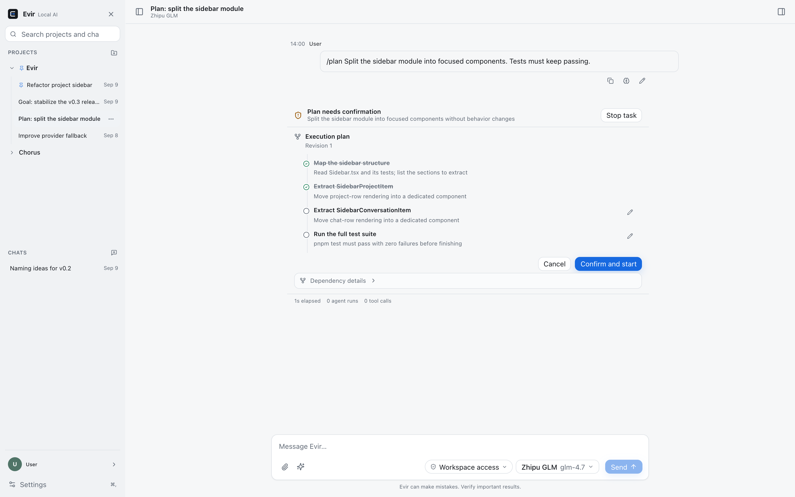
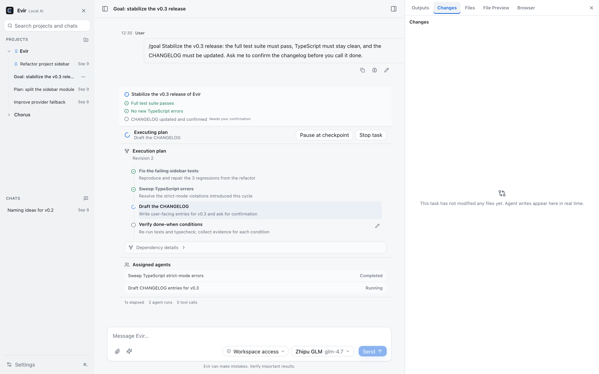
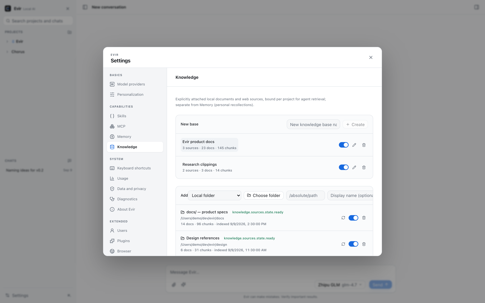

<picture>
  <source media="(prefers-color-scheme: dark) and (max-width: 600px)" srcset="./assets/readme-hero-mobile-dark.svg">
  <source media="(max-width: 600px)" srcset="./assets/readme-hero-mobile-light.svg">
  <source media="(prefers-color-scheme: dark)" srcset="./assets/readme-hero-dark.svg">
  <source media="(prefers-color-scheme: light)" srcset="./assets/readme-hero-light.svg">
  
</picture>

<div align="center">

# Evir

**你的模型，你的电脑，你的 Agent。**

一个纯净、本地优先、用户自带模型的 **Desktop Project Agent**：打开一个项目，告诉 Evir 要完成什么，它安全地读、改、运行、验证，并让你清楚看到它做了什么、改了什么、哪里失败、是否真的完成。

**接入一个支持工具调用的大模型即可开工**——无账号、无积分、无云端后端。

[English](README.en.md) · [产品需求](docs/01-product-requirements.md) · [开发指南](docs/03-development-guide.md)

</div>

---


## Desktop Project Agent（主产品）

Desktop 侧栏分为 **PROJECTS** 和 **CHATS** 两区。一个 Project 对应一个本地目录：在项目里新建任务后，Agent 的工作目录就是项目根目录。项目线程是一个**工作台**，不是聊天窗：

- **任务流** — 你的指令、Agent 的每一步工具调用、审批卡、结果摘要按工作顺序排列；每次文件修改直接显示 `路径 +diffstat`，点击即开 Diff。
- **Context Workbench（右栏）** — 产出 / 变更 / 文件 / 预览 / 浏览器。Agent 修改代码后自动切到**变更**（你在看预览/浏览器时只加角标，不抢焦点）；每文件 diffstat、复制补丁、回滚一应俱全。
- **可驾驶** — 运行中随时 Stop，下一条指令可排队（任务结束自动发送）；顶栏常显任务状态（准备中/运行中/验证中/待审批）。

```text
创建 Project（选择目录） → 新建任务 → 选择 Permission / Model
→ Evir 判断是否需要工具 → 读取 · 修改 · 执行 · 验证 → Diff / 快照 / 回滚
```

- **默认 Project Task**：普通问答直接回复；需要操作项目时，按权限策略使用 13 个内置工具（读/写/搜索/patch/命令/git/快照）与 MCP 工具，可暂停、审批、回滚。Plan / Goal 通过 `/plan`、`/goal` 触达。
- **Plan**：只用只读工具检查项目并产出结构化计划（含验证节点），一键 **Execute Plan** 转入 Agent 执行。
- **Goal**：面向长期目标，附带“完成条件”；Evir 用真实证据逐条验证，模型说“完成”不算完成。

<p align="center">
  
  
</p>

### 权限决定自动程度


第一次打开项目时由你明确选择：**Workspace Access**（推荐，项目内自动放行并写入审计）或 **Ask every time**（更谨慎，写操作逐次审批）。**Full Access** 解除目录边界，首次开启必须明确确认。工具边界在 Tool Registry 与 Rust 侧双层强制，不靠提示词约束。

## 自带模型（BYOM）——按成熟度分级

“能聊天 ≠ 能工具调用 ≠ 能稳定跑完 Project Agent 任务”。分级是**模型级**的：证据按 provider + 具体 modelId + 端点归属记录（`src/core/providers/provider-validation.json`），**跨模型、跨端点不借证据**；每次真实评估（无论通过与否）都进历史，**当前档位由该模型最新一次真实评估决定**——新失败会覆盖旧通过（Needs Revalidation）。设置页、下表与验证数据由 `scripts/check-doc-facts.mjs` 门禁保持同源一致。

| 分级                  | 含义                                                     | 厂商                                                                                      |
| --------------------- | -------------------------------------------------------- | ----------------------------------------------------------------------------------------- |
| **Agent Verified**    | 最新一次全量（20 任务）真实端点 Golden Agent Tasks 通过  | 智谱 BigModel / GLM                                                                       |
| **Smoke Verified**    | 最新一次真实端点评估为 10 任务冒烟规模通过，尚未全量验证 | 暂无                                                                                      |
| **Protocol Verified** | 流式 + 工具调用协议有自动化覆盖                          | OpenAI、Anthropic、Google Gemini API、Microsoft Azure OpenAI、Ollama、智谱 BigModel / GLM |
| **Preset**            | 配置模板，无 Agent 级验证                                | 其余 30 家内置预设                                                                        |

当前唯一模型级 Agent Verified 证据：智谱 preset 下的 `evomap-deepseek-v4-flash`（DeepSeek 系模型，经 EvoMap 第三方网关、`openai-compatible-chat` 协议接入）于 2026-09-09 以全量 20 任务 required suite 真实跑 Golden Agent Tasks，16/20 通过（0.8）、工具成功率 0.891、0 越权、0 越界。完整历史（同日早些时候一次 17/20 但含 2 处越界 → 如实记为 partial，不被后续 pass 掩盖）见 `src/core/providers/provider-validation.json`。**该证据只属于这个模型**——不代表 GLM 系模型（模型间证据不互借）；GLM 系模型目前为 Protocol Verified，待各自全量真实评估后按最新结果定档。历史手工真机 QA 记录另见 [Release Readiness](docs/release-readiness.md)。

Provider、协议、模型能力三层分离：已实现 7 种协议适配器（OpenAI Chat Completions / Responses、Anthropic Messages、Gemini、Azure OpenAI、Ollama 原生、OpenAI-compatible），支持自定义兼容端点。API Key 存本地加密 vault（AES-256-GCM），密钥永远不进日志。


模型能力（流式、工具调用、图片、结构化输出）在使用前明确展示；不支持工具调用的模型仍可在 Project 中聊天，但不会获得项目工具。完整矩阵见 [Provider 与协议矩阵](docs/13-provider-and-protocol-matrix.md)。

## 产品面与成熟度

**Evir Desktop 是主产品**；其余产品面按真实成熟度标注，不并列营销：

| 产品面                                  | 成熟度       | 说明                                                                    |
| --------------------------------------- | ------------ | ----------------------------------------------------------------------- |
| **Desktop**                             | **Primary**  | 全部核心产品设计优先；Agent Eval 优先；macOS / Windows 优先             |
| Web                                     | Supported    | 纯净多模型聊天，持续保留与维护，不复制 Desktop Agent 能力               |
| VS Code                                 | Preview      | 编辑器内 Agent（配置/Ask/Agent/审批/Diff 回滚），持续演进               |
| CLI                                     | Preview      | `evir` configure/doctor/ask/agent，持续演进                             |
| Plugin / Multi-user / Canvas / Ego Lite | **Extended** | 已交付能力，保留维护并继续优化；新增复杂度以核心 Agent 质量不退化为前提 |

优先级管理而非冻结：Desktop Project Agent 是最高质量优先级；Plugin、Multi-user、Canvas、Ego Lite、Browser Provider、Web / VS Code / CLI 都是已交付能力，继续保留、维护、优化。新增任何复杂能力需守住核心 Agent 质量 / Runtime / 性能预算 / Golden Eval 四条不退化红线。

## 知识库（Knowledge Base v1）

显式接入的知识源，按项目绑定供 Agent 检索——与 Memory（个人记忆沉淀）相互独立：



- **六类知识源**：本地文件夹 / 本地文件 / 项目文档目录 / 网页 URL（显式添加、记录抓取时间）/ MCP Resource（文本型）/ 历史任务产物（从真实 run 记录派生，不信任模型自述）。
- **结构优先分块**：标题分区、代码块不切断、段落打包；Markdown / 文本 / 代码 / JSON / CSV / HTML / PDF（复用内置 pdf.js 抽取）。
- **检索即溯源**：命中片段带 `文档 › 标题 | 路径/URL` 出处；Agent 用知识回答时，运行详情（Trace）记录 `knowledge.retrieved` 事件；检索不到时诚实返回 no-result，不编造知识库内容。
- **权限与隔离**：本地源必须在项目授权目录内（workspace/额外授权目录），Rust 边界二次校验；知识库数据按用户 Profile 物理隔离；删除知识源只删索引，不动你的原文件。
- **预算受控**：注入上下文的知识量受剩余预算硬上限约束；`search_knowledge` 工具（L1 只读）供模型主动查询。
- **验证**：`pnpm test:knowledge-eval`（10 项检索金任务：多文件/CSV/JSON/HTML/冲突知识/过时知识/诚实无结果/绑定隔离/Profile 隔离）。

## Skill：质量优先

内置 Skill 分两层：**15 个核心编码 Skill**（systematic-debugging、test-driven-development、code-review、security-review、verification-before-completion 等，面向 Coding / Project Agent 主路径精选）+ **通用可选包**（办公、写作、分析等，设置里可自选启用）。Skill 数量不是 KPI——核心 Skill 的价值由 [Agent Eval](eval/) 对照验证。

## 本地优先与可诊断

```text
API Key            → 本地加密 vault（AES-256-GCM）
Provider 配置       → 版本化非敏感本地文件
会话 / 任务 / 记忆  → 嵌入式本地存储（SQLite / IndexedDB）
日志 / Diff / 快照  → 本地文件目录
```

- 无账号、无积分、无广告、无必需云端后端；数据默认留在你的设备。
- 日志覆盖 Provider / Agent / 工具 / 审批 / 性能，默认脱敏、本地保存、滚动清理；**无远程读取日志的后门**，诊断包由你手动导出。
- 上下文压缩、三层记忆、检查点与崩溃恢复内置；单个模型即可完成全部压缩，不强制第二模型。

## 质量与验证

- **确定性测试**：`pnpm check`（format + lint + strict TS + 全部单测 + Rust 测试 + 发布校验）+ E2E / UI / 视觉 / 无障碍矩阵。当前基线数字以 [Release Readiness](docs/release-readiness.md) 为唯一事实源，不在 README 里复制会漂移的数字。
- **Agent Eval**：20 个 Golden Agent Tasks 跑在冻结 fixture 仓库上（`pnpm test:agent-eval`），指标含成功率、越权操作（必须为 0）、越界修改（必须为 0）、恢复、证据。真实 Provider 档已实跑（GLM 经 EvoMap 网关 10 任务 9 过 / 20 任务 18 过，见 [eval/README](eval/README.md)）。
- **多场景 Eval**：数据 / 网页 / 文档 / 自动化黄金任务（`pnpm test:multi-scenario`，另有真实档）；**知识库 Eval**：`pnpm test:knowledge-eval`。
- 性能预算与实测数字以 [最近一次基准](docs/benchmarks/latest.json) 为准（Web 初始 JS gzip ≤ 350 KiB、桌面前端 ≤ 15 MiB、冷启动 P50 < 2s）。

## 当前状态

Evir 仍在积极开发中，**尚未发布**（无 LICENSE 文件，见下方说明）。核心链路（聊天、Agent 工具与审批、Plan/Goal、权限档位、快照回滚、MCP 连接、日志与诊断导出）已实现。**逐项验证状态（含 NOT RUN / BLOCKED 清单）以 [Release Readiness](docs/release-readiness.md) 为准**：Windows、30–60 分钟长任务、升级/降级等尚未验证。安装包默认 ad-hoc 签名（可正常运行）；Developer ID 签名/公证为可选增强。

## 本地开发

```bash
pnpm install
pnpm dev:web        # Web 开发服务器
pnpm dev:desktop    # Tauri Desktop（需 Rust + Tauri 2 依赖）
pnpm check          # format + lint + strict TS + 全部单测 + Rust 测试 + 发布校验
pnpm test:e2e       # Playwright E2E（web + desktop 模式）
pnpm test:agent-eval # Agent Eval：20 个 Golden Tasks（§80 独立输出）
pnpm benchmark      # 产物体积门禁
```

构建与发布（macOS arm64/x64 DMG、Windows x64 MSI、VSIX、CLI tarball）见[开发指南](docs/03-development-guide.md)。要求 Node.js 20+、pnpm 9+、Rust stable。

## 文档

- 当前状态与事实索引：[Release Readiness](docs/release-readiness.md) · [项目记忆索引](docs/agent/Evir-project-memory.md)
- 产品与架构：[产品需求](docs/01-product-requirements.md) · [技术架构](docs/02-technical-architecture.md)
- 规范：[设计](docs/04-design-specification.md) · [工程](docs/05-engineering-standards.md) · [Agent 安全与质量](docs/07-agent-security-and-quality.md)
- 专项：[Skill 与 MCP](docs/08-skill-and-mcp.md) · [Provider 矩阵](docs/13-provider-and-protocol-matrix.md) · [Agent Eval](eval/README.md)

## License

许可证将在正式开源发布前确定。引入第三方依赖时必须记录并核验其许可证。
