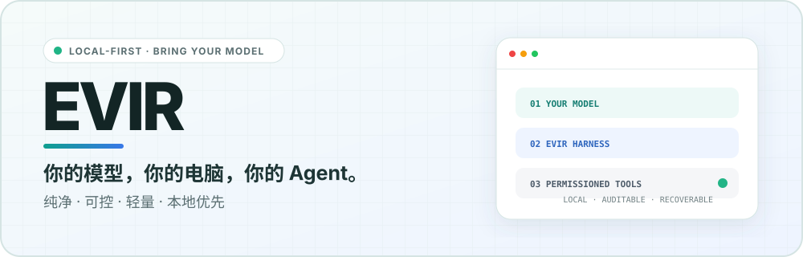

<picture>
  <source media="(prefers-color-scheme: dark) and (max-width: 600px)" srcset="./assets/readme-hero-mobile-dark.svg">
  <source media="(max-width: 600px)" srcset="./assets/readme-hero-mobile-light.svg">
  <source media="(prefers-color-scheme: dark)" srcset="./assets/readme-hero-dark.svg">
  <source media="(prefers-color-scheme: light)" srcset="./assets/readme-hero-light.svg">
  
</picture>

<div align="center">

# Evir

**你的模型，你的电脑，你的 Agent。**

一个纯净、本地优先、用户自带模型的多模型 AI 客户端与通用桌面 Agent。

**接入一个支持工具调用的大模型，即可让 Evir Desktop 在你的项目里读代码、改文件、跑命令并自我验证。**

[English](README.en.md) · [产品需求](docs/01-product-requirements.md) · [开发指南](docs/03-development-guide.md) · [开发计划](docs/06-development-plan.md)

</div>

---


## 在真实项目里工作

Desktop 侧栏分为 **PROJECTS** 和 **CHATS** 两区。一个 Project 对应一个本地目录：在项目里新建任务后，Agent 的工作目录就是项目根目录，不需要再手动选择工作区；目录被移动后重新定位即可，历史任务与权限全部保留。

项目任务的输入框上方是一组紧凑控件，决定任务**怎么工作**：

- **Mode** — 默认 Project Task 会按任务决定是否使用 Agent 工具；只把 Plan / Goal 作为显式特殊工作方式（普通聊天在 CHATS 区，永远是 Ask，不触碰本地文件）。
- **Permission** — 按项目选择自动程度。
- **Model** — 由谁工作，随时切换。

```text
创建 Project（选择目录） → 新建任务 → 选择 Permission / Model（按需切换 Plan / Goal）
→ Evir 判断是否需要工具 → 读取 · 修改 · 执行 · 验证 → Diff / 快照 / 回滚
```

- **默认 Project Task**：普通问答直接回复；需要操作项目时，按权限策略使用 13 个内置工具（读/写/搜索/patch/命令/git/快照）与 MCP 工具，可暂停、审批、回滚。
- **Plan**：只用只读工具检查项目并产出结构化计划，一键 **Execute Plan** 转入 Agent 执行。
- **Goal**：面向长期目标，附带“完成条件”；Evir 用真实证据逐条验证，模型说“完成”不算完成。

### 权限决定自动程度


每个 Project 独立配置三档权限：**Ask for Approval**（默认，写操作逐次审批）、**Workspace Access**（项目内自动放行并写入审计）、**Full Access**（解除目录边界，首次开启必须明确确认）。还可以为项目添加额外授权目录。工具边界在 Tool Registry 与 Rust 侧双层强制，不靠提示词约束。

## 自带模型（BYOM）

Provider、协议、模型能力三层分离：内置 36 家国内外厂商预设，已实现 7 种协议适配器（OpenAI Chat Completions / Responses、Anthropic Messages、Gemini、Azure OpenAI、Ollama 原生、OpenAI-compatible），支持自定义兼容端点。API Key 存本地加密 vault（AES-256-GCM，不依赖系统钥匙串），密钥永远不进日志。


模型能力（流式、工具调用、图片、结构化输出）在使用前明确展示；不支持工具调用的模型仍可在 Project 中聊天，但不会获得项目工具，Plan/Goal 也不可用并会说明原因。会话中切换模型经安全检查点处理上下文、附件与数据去向；默认不做跨 Provider 自动回退。完整矩阵见 [Provider 与协议矩阵](docs/13-provider-and-protocol-matrix.md)。

## 四种产品形态，一套核心能力

|                                | Evir Desktop     | Evir Web       | Evir for VS Code   | Evir CLI         |
| ------------------------------ | ---------------- | -------------- | ------------------ | ---------------- |
| 定位                           | 通用桌面 Agent   | 纯净多模型聊天 | 编辑器内 Agent     | 终端 Agent       |
| 聊天 / 附件                    | ✅               | ✅             | ✅                 | ✅（ask）        |
| 本地工具 / 终端 / Git          | ✅               | —              | ✅（受信任工作区） | ✅（工作区边界） |
| Project Task / Plan / Goal     | ✅               | —              | Agent              | Agent            |
| Skill                          | 36 个内置 + 自建 | 10 个指令型    | —                  | —                |
| MCP（stdio + Streamable HTTP） | ✅               | —              | —                  | —                |

- **Web**：静态部署即用的聊天客户端，浏览器直连模型 API，无 Evir 后端；部分厂商限制浏览器 CORS 时会明确提示。
- **VS Code**（Preview）：独立 VSIX，密钥存 VS Code SecretStorage；写入与命令逐次审批，最后一次写入支持 Diff 与回滚。VS Code Web / Remote / MCP / Skill 暂不支持。
- **CLI**（Preview）：独立 `evir` 命令（configure / doctor / ask / agent），与 Desktop 共享非敏感 Provider 配置（密钥各自独立存储），不要求 Desktop 运行。


## 本地优先与可诊断

```text
API Key            → 本地加密 vault（AES-256-GCM）
Provider 配置       → 版本化非敏感本地文件
会话 / 任务 / 记忆  → 嵌入式本地存储（SQLite / IndexedDB）
日志 / Diff / 快照  → 本地文件目录
```

- 无账号、无积分、无广告、无必需云端后端；数据默认留在你的设备。
- 日志覆盖 Provider / Agent / 工具 / 审批 / 性能，默认脱敏、本地保存、滚动清理。
- 诊断页可查看脱敏事件、导出 JSON，或一键**导出诊断包 ZIP**（系统与配置元数据 + 本地日志，导出前预览体积与文件数）——由你手动发送，Evir 没有任何远程读取日志的后门。
- 上下文压缩、三层记忆、检查点与崩溃恢复内置；单个模型即可完成全部压缩，不强制第二模型。

## 性能预算

Tauri 2，不内置完整 Chromium；Skill 正文、MCP、设置面板按需加载；流式增量批量渲染。工程预算：Web 初始 JS gzip ≤ 350 KiB（当前 290.3 KiB）、桌面前端 ≤ 15 MiB（当前 2.69 MiB）、冷启动 P50 < 2s（原生实测 0.84s）、空闲内存 ≤ 150 MB（原生实测约 71 MB）。带“当前”的数字来自 [最近一次基准](docs/benchmarks/latest.json)与 2026-08-28 原生实测，其余为尚未正式测量的目标值，不以目标冒充结果。

## 当前状态

Evir 仍在积极开发中，**尚未发布**（无 LICENSE 文件，见下方 License 说明）。核心链路（聊天、Agent 工具与审批、Plan/Goal、权限档位、快照回滚、MCP 连接、日志与诊断导出）已实现并有 682 个 TypeScript 测试 + 43 个 Rust 测试 + E2E/视觉/无障碍矩阵覆盖，真实 Provider（GLM）与 macOS 原生多工具任务已有历史实机验收；2026-08-28 原生复验通过配置 Provider、中文/空格路径项目、计划确认、L3 逐次审批写入真实磁盘与重启持久化。**逐项验证状态（含 NOT RUN 清单）以 [Release Readiness](docs/release-readiness.md) 为准**：Windows、30–60 分钟长任务、升级/降级等尚未验证；VS Code 与 CLI 为 Preview。API Key 存本地加密 vault，重建后无需重新授权系统钥匙串。安装包默认 ad-hoc 签名（可正常运行）；Developer ID 签名/公证为可选增强。

## 本地开发

```bash
pnpm install
pnpm dev:web        # Web 开发服务器
pnpm dev:desktop    # Tauri Desktop（需 Rust + Tauri 2 依赖）
pnpm check          # format + lint + strict TS + 全部单测 + Rust 测试 + 发布校验
pnpm test:e2e       # Playwright E2E（web + desktop 模式）
pnpm benchmark      # 产物体积门禁
node scripts/capture-readme-screenshots.mjs  # 重新生成 README 截图
```

构建与发布（macOS arm64/x64 DMG、Windows x64 MSI、VSIX、CLI tarball）见[开发指南](docs/03-development-guide.md)。要求 Node.js 20+、pnpm 9+、Rust stable。

## 文档

- 产品与架构：[产品需求（当前信息架构）](docs/01-product-requirements.md) · [技术架构](docs/02-technical-architecture.md)
- 规范：[设计](docs/04-design-specification.md) · [工程](docs/05-engineering-standards.md) · [Agent 安全与质量](docs/07-agent-security-and-quality.md) · [Harness](docs/16-harness-engineering-for-evir.md) · [日志与诊断](docs/17-local-logging-and-diagnostics.md)
- 专项：[Skill 与 MCP](docs/08-skill-and-mcp.md) · [Provider 矩阵](docs/13-provider-and-protocol-matrix.md) · [VS Code 路线](docs/19-vscode-extension-and-editor-roadmap.md) · [CLI 规格](docs/20-cli-product-and-technical-specification.md)
- 测试与证据：[全项目测试用例](docs/23-full-project-test-cases.md) · [当前门禁基线](docs/agent/Evir-project-memory.md) · [MCP 实现状态](docs/22-mcp-runtime-implementation-plan.md)

## License

许可证将在正式开源发布前确定。引入第三方依赖时必须记录并核验其许可证。
